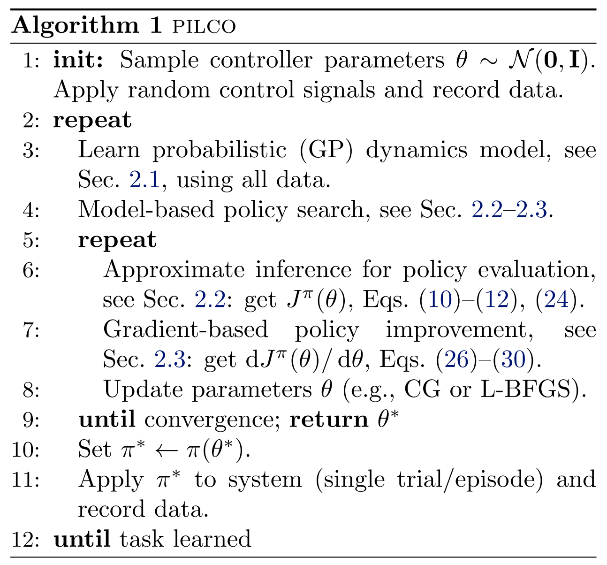
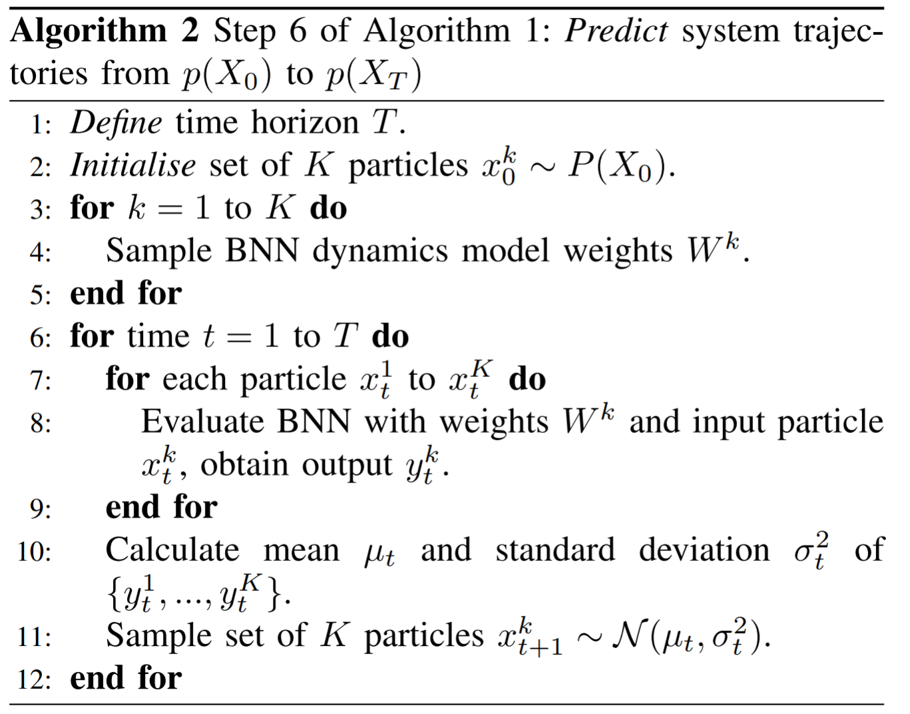
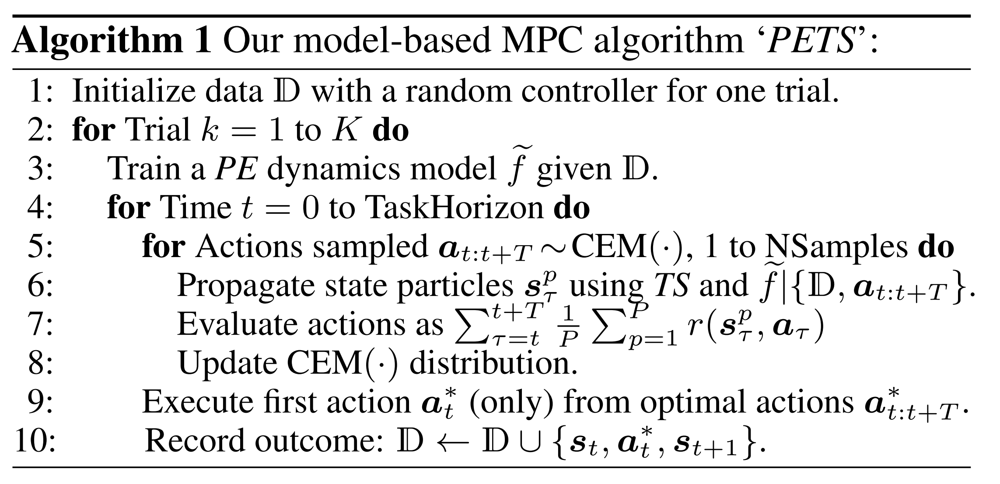

## Outline

- Introduction
- PILCO
- DeepPILCO
- PETS

----

## PILCO

**Motivation**

model-based方法有着较好的efficiency，但存在一定的局限性：model bias（对于小样本&无先验，这个问题更为严重），使用有bias的model去预测，进而会带来更大的误差。

----

**Solution**

学习一个probabilistic dynamics model，这样的model能够express uncertainty。在PILCO中，使用GP regression来学习这个probabilistic dynamics model。

believe刚才学到的model，**不做rollout，而是直接计算**
$$
J^\pi=\mathbb{E}_{\mathbf{x}_{t}}\left[c\left(\mathbf{x}_{t}\right)\right]=\int c\left(\mathbf{x}_{t}\right) \mathcal{N}\left(\mathbf{x}_{t} \mid \mu_{t}, \boldsymbol{\Sigma}_{t}\right) \mathrm{d} \mathbf{x}_{t}
$$
之后采用基于梯度($\frac{\mathrm{d}J}{\mathrm{d}\theta}$)的Policy Search，找到最优参数，使得
$$
\theta^* = {\arg\min}_\theta J^{\pi_\theta}
$$
此时得到$\pi^*=\pi_{\theta^*}$

----

----

## Improving PILCO with Bayesian neural network dynamics models

**Motivation**

GP regression不适合对复杂环境（e.g. 高维度）建模。

**Solution**

主要考虑是将regression替换为NN (Neural Network)，但需要解决带来的两个问题：Output Uncertainty & Input Uncertainty

1) Output Uncertainty

将GP regression 替换为NN，能够进行更复杂的建模，但一般的NN不能express model uncertainty，考虑使用BNN (Bayesian Neural Network) 。

----

2) Input Uncertainty

PILCO因为使用了GP regression，因此可以analytically propagates state distributions through the dynamics model, i.e. 推导出分布 $p(X_0),\ldots ,p(X_T)$，这些分布能够表示不确定的input $X_0,\ldots,X_T$。

但若使用BNN，他的输入层只能接受确定性的input，无法表示所需要的不确定性，因此考虑使用particle methods：

----

----

## Deep Reinforcement Learning in a Handful of Trials using Probabilistic Dynamics Models

**Motivation**

和上一篇一样在解决PILCO的complexity问题

**Solution**

整体的核心思想和上一篇DeepPILCO一样：用更复杂的NN来代替GP regression，并解决所带来的 uncertainty 问题。不过这一篇的结果要比上一篇好很多。

----

**1.PE (Probabilistic Ensemble)**

1) aleatoric (inherent system stochasticity)

使用probabilistic NN来解决aleatoric uncertainty（上一篇的output uncertainty）

与Bayesian NN不同的是，这篇文章使用了 log prediction probability 来express uncertainty：
$$
\operatorname{loss}_{\mathrm{P}}(\boldsymbol{\theta})=-\sum_{n=1}^{N} \log \tilde{f}_{\boldsymbol{\theta}}\left(\boldsymbol{s}_{n+1} \mid \boldsymbol{s}_{n}, \boldsymbol{a}_{n}\right)
$$
该NN的input是$\boldsymbol{s},\boldsymbol{a}$，output为$\tilde{f}_\theta$，是一个parameterized distribution。

----

2) epistemic (subjective uncertainty, due to limited data)

使用Ensemble来解决epistemic uncertainty

核心思想就是对多个Probabilistic NN进行ensemble：consider ensembles of $B$-many bootstrap models, using $\theta_b$ to refer to the parameters of our $b^{\mathrm{th}}$ model $\tilde{f}_{\theta_b}$, then get $\tilde{f}_{\theta}=\frac{1}{B}\sum_{b=1}^{B}\tilde{f}_{\theta_b}$.

----

**2.TS (trajectory sampling)**

create P particles from the current state, $s_{t=0}^p=s_0 \forall p$，每个particle都服从分布进行传播：$\boldsymbol{s}_{t+1}^{p} \sim \widetilde{f}_{\boldsymbol{\theta}_{b(p, t)}}\left(\boldsymbol{s}_{t}^{p}, \boldsymbol{a}_{t}\right)$，其中particle的选择是基于一个bootstrap $b(p,t)\in\{1,\ldots,B\}$，最终将P组Particles采集到的结果进行ensemble。

{width=80%}

