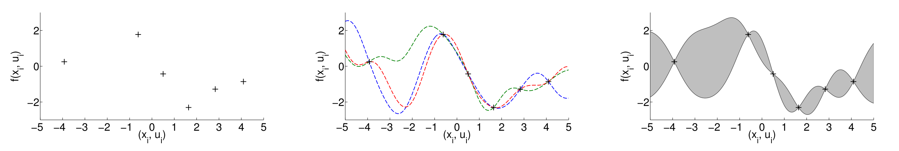

## 幻灯片目录

- 幻灯片1
- 幻灯片2
- 幻灯片3
- 总结

----

## 标题 Title

**子标题 subtitle**

model-based方法有着较好的**样本效率**，但存在一定的*局限性*：model bias（对于小样本&无先验，这个问题更为严重），使用有bias的model去预测，进而会带来*更大的***误差**。

基于所学到的model，可以**不做rollout，而是直接计算**
$$
J^\pi=\mathbb{E}_{\mathbf{x}_{t}}\left[c\left(\mathbf{x}_{t}\right)\right]=\int c\left(\mathbf{x}_{t}\right) \mathcal{N}\left(\mathbf{x}_{t} \mid \mu_{t}, \boldsymbol{\Sigma}_{t}\right) \mathrm{d} \mathbf{x}_{t}
$$

